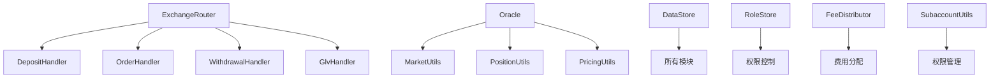

# GMX Synthetics 产品需求文档（PRD）
 
---

## 1. 核心用户与使用场景

### 1.1 流动性提供者（LP）

**用户画像**：拥有闲置加密资产，寻求稳定收益的投资者

**核心用户故事**：
> **作为** 一个持有 ETH 和 USDC 的投资者，  
> **我希望** 能够安全地提供流动性并获得被动收入，  
> **以便于** 我的闲置资产可以产生持续的收益回报。

**具体使用场景**：
- **场景描述**：用户向 ETH/USD 市场存入 10 ETH + 30,000 USDC
- **操作流程**：
  1. 连接钱包，选择目标市场
  2. 输入存款金额，确认交易（**仅需1次签名**）
  3. **等待 Keeper 执行**：存款请求进入队列，等待专业 Keeper 在下一区块执行
  4. **执行过程**：Keeper 获取最新预言机价格，计算并铸造 LP 代币（通常 2-5 分钟）
  5. 开始获得交易手续费和借贷费用分成

**收益预期**：年化收益率 8-15%，由以下部分组成：
- 交易手续费分成（约 60%）
- 借贷费用分成（约 30%）
- 交易者亏损收益（约 10%）

### 1.2 永续合约交易者

**用户画像**：专业交易者或有杠杆交易需求的投资者

**核心用户故事**：
> **作为** 一个看好 ETH 长期走势的交易者，  
> **我希望** 使用 10 倍杠杆做多 ETH，并设置止损保护，  
> **以便于** 我能够放大收益的同时控制风险。

**具体使用场景**：
- **场景描述**：用户开立 10 倍杠杆 ETH 多头仓位
- **操作流程**：
  1. 存入 1,000 USDC 作为保证金
  2. 选择 10 倍杠杆，开立 10,000 USDC 规模多头仓位
  3. 设置止损价格（如当前价格的 95%）
  4. 系统自动监控，触发条件时执行止损

**交易成本**：
- 开仓费用：0.05%-0.1%
- 资金费用：根据多空平衡动态调整
- 借贷费用：年化 2-8%

### 1.3 交换用户

**用户画像**：需要大额代币兑换的 DeFi 用户

**核心用户故事**：
> **作为** 一个需要兑换大额代币的用户，  
> **我希望** 获得更好的价格和更低的滑点，  
> **以便于** 减少我的交易成本。

**具体使用场景**：
- **场景描述**：用户将 100 ETH 兑换为 USDC
- **操作流程**：
  1. 输入兑换数量，查看预估输出和滑点
  2. 确认交易，系统自动路由最优路径
  3. 通过多个流动性池完成兑换，获得最佳价格

### 1.4 系统运营者（Keeper）

**用户画像**：专业的区块链服务提供商或协议运营团队

**核心用户故事**：
> **作为** 系统 Keeper 运营者，  
> **我希望** 能够及时执行用户请求并获得执行奖励，  
> **以便于** 维护系统正常运行并获得稳定收益。

#### 场景 1：执行用户存款请求

**场景描述**：Keeper 监控并执行待处理的流动性存款请求

**操作流程**：
1. 监控区块链上的存款请求事件
2. 等待区块确认（通常 1-2 个区块）
3. 获取最新的预言机价格数据
4. 调用执行函数完成存款，铸造 LP 代币
5. 获得执行费用奖励（通常 1-5 USDC）

**技术要求**：
- 24/7 监控系统运行
- 快速获取和验证预言机价格
- Gas 费用优化和批量执行能力
- 失败重试和错误处理机制

#### 场景 2：执行交易订单

**场景描述**：Keeper 执行用户提交的永续合约交易订单

**操作流程**：
1. 扫描订单池中的待执行订单
2. 验证订单执行条件（价格触发、保证金充足等）
3. 获取实时价格数据并验证偏差范围
4. 执行订单：开仓、平仓或调整仓位
5. 更新用户仓位状态和市场数据
6. 收取执行费用（0.1-0.5% 或固定费用）

**执行优先级**：
- 紧急平仓（强制清算）：最高优先级
- 止损/止盈触发：高优先级
- 市价单：中等优先级
- 限价单：低优先级

#### 场景 3：执行自动减仓（ADL）

**场景描述**：当市场出现极端情况时，Keeper 执行自动减仓机制

**触发条件**：
- 某个方向仓位敞口过大（超过设定阈值）
- 流动性不足以支持正常清算
- 价格大幅波动导致系统风险增加

**操作流程**：
1. 监控市场风险指标（敞口比率、流动性指标）
2. 识别需要减仓的盈利仓位（按盈利率排序）
3. 计算最优减仓数量和价格
4. 执行自动减仓，强制平部分盈利仓位
5. 更新市场平衡状态
6. 向受影响用户发放补偿（通常为减仓费用）

**风险控制**：
- 严格按照算法选择减仓目标
- 实时计算和验证减仓影响
- 确保减仓过程透明可审计

#### 场景 4：执行清算操作

**场景描述**：Keeper 清算保证金不足的用户仓位

**清算触发条件**：
- 用户保证金率 < 维持保证金率（通常 2-5%）
- 未实现亏损超过可承受范围
- 借贷费用累积导致保证金不足

**操作流程**：
1. 实时监控所有用户仓位的保证金状态
2. 识别触发清算条件的仓位
3. 验证清算的合规性和必要性
4. 执行强制平仓，计算清算价格
5. 分配清算费用：
   - 清算者奖励：1-5%
   - 保险基金：剩余部分
   - 用户：扣除费用后的剩余保证金

**保护机制**：
- 部分清算：优先尝试部分平仓恢复保证金率
- 价格保护：避免清算造成过大价格冲击
- 时间延迟：给用户补充保证金的缓冲时间

#### 场景 5：资金费率结算

**场景描述**：Keeper 定期执行资金费率结算

**执行频率**：每 8 小时结算一次

**操作流程**：
1. 计算当前期间的资金费率
2. 统计所有多头和空头仓位
3. 计算每个仓位应付/应收的资金费用
4. 批量执行资金费用转移
5. 更新用户账户余额
6. 记录结算数据供审计使用

**资金费率计算**：
```
资金费率 = (多头未平仓合约价值 - 空头未平仓合约价值) / 总未平仓合约价值 × 费率系数
用户应付费用 = 仓位规模 × 资金费率 × 时间权重
```

**Keeper 激励机制**：
- **基础执行费**：每次成功执行获得固定费用
- **复杂度奖励**：根据操作复杂程度获得额外奖励
- **及时性奖励**：快速响应获得时间奖励
- **质量保证**：错误执行面临罚金扣除

### 1.5 GLV 投资者

**用户画像**：寻求多元化投资、风险分散的机构和个人投资者

**核心用户故事**：
> **作为** 一个希望投资GMX生态的投资者，  
> **我希望** 通过单一代币投资多个GM市场组合，  
> **以便于** 获得分散化收益并降低单一市场风险。

**具体使用场景**：
- **场景描述**：投资者购买GLV代币获得多市场敞口
- **操作流程**：
  1. 选择目标GLV产品（如BTC-ETH平衡型GLV）
  2. 使用USDC或其他支持代币购买GLV份额
  3. GLV自动分配资产到多个GM市场
  4. 享受多市场综合收益和自动重平衡
  5. 可随时赎回GLV代币退出投资

**GLV优势**：
- **风险分散**：投资多个市场降低单点风险
- **专业管理**：自动化资产配置和重平衡
- **流动性便利**：单一代币管理多元化投资
- **费用效率**：避免多次单独投资的Gas成本

### 1.6 子账户用户

**用户画像**：程序化交易者、机构用户、策略管理团队

**核心用户故事**：
> **作为** 一个需要程序化交易的专业用户，  
> **我希望** 通过子账户系统实现安全的自动化策略执行，  
> **以便于** 在保护主账户安全的同时实现高效的策略管理。

**具体使用场景**：
- **场景描述**：机构用户为交易机器人设置子账户权限
- **操作流程**：
  1. 创建子账户并设置权限范围（如只能交易特定市场）
  2. 设置操作限制（如每日最大交易次数、权限过期时间）
  3. 子账户执行自动化交易策略
  4. 主账户监控和管理子账户权限
  5. 根据需要调整或撤销子账户权限

**权限类型**：
- **交易权限**：开仓、平仓、订单管理
- **资产权限**：代币转移、存取款操作
- **时间限制**：权限自动过期机制
- **数量限制**：每日/每月操作次数上限

### 1.7 协议治理者

**用户画像**：GMX代币持有者、DAO成员、协议核心团队

**核心用户故事**：
> **作为** 协议治理参与者，  
> **我希望** 通过民主决策机制参与协议重大决策，  
> **以便于** 确保协议长期健康发展并保护所有参与者利益。

#### 场景 1：参数调整治理

**场景描述**：治理者投票决定关键协议参数的调整

**治理范围**：
- **费率参数**：交易手续费、借贷费率、资金费率
- **风控参数**：最大杠杆倍数、维持保证金比例、清算阈值
- **限额设置**：单个市场最大敞口、用户持仓限额
- **激励参数**：Keeper奖励、流动性挖矿分配

**治理流程**：
1. **提案阶段**：社区成员或核心团队提出参数调整提案
2. **讨论期**：7天社区讨论，收集反馈和建议
3. **投票期**：持有GMX代币的用户进行链上投票（持续3天）
4. **执行延迟**：通过提案后24-48小时执行，确保用户有时间调整策略
5. **参数生效**：新参数通过时间锁合约自动生效

**投票权重**：
```
投票权重 = GMX代币持有量 × 代币锁定时间权重
最大权重系数 = 2.0（锁定4年时）
最小权重系数 = 1.0（无锁定）
```

#### 场景 2：紧急响应治理

**场景描述**：面对安全威胁或市场极端情况的紧急治理响应

**紧急权限**：
- **功能暂停**：立即暂停特定功能（存款、提款、交易）
- **参数紧急调整**：风险参数的快速调整（如降低杠杆上限）
- **资金保护**：激活保险基金或紧急流动性支持
- **系统升级**：关键安全补丁的快速部署

**紧急治理流程**：
1. **威胁识别**：监控系统发现异常或收到安全报告
2. **紧急委员会**：5-7人紧急委员会快速评估和决策
3. **多签执行**：3/5多签即可执行紧急措施
4. **社区通知**：立即向社区公告紧急措施和原因
5. **后续治理**：72小时内进行正式治理投票确认或撤销

**紧急委员会成员**：
- 核心开发团队代表（2名）
- 大户代表（2名）
- 社区选举代表（2名）
- 安全专家（1名）

#### 场景 3：协议升级治理

**场景描述**：重大协议功能更新和合约升级的治理决策

**升级类型**：
- **功能添加**：新交易对上线、新产品功能
- **安全升级**：合约安全性改进、漏洞修复
- **性能优化**：Gas费用优化、执行效率提升
- **集成扩展**：与其他协议的集成、跨链支持

**升级治理流程**：
1. **技术提案**：详细技术规范和影响评估（21天讨论期）
2. **安全审计**：独立第三方安全审计报告
3. **测试网验证**：在测试网进行完整功能测试
4. **社区投票**：正式链上投票（7天投票期）
5. **分阶段部署**：
   - 第一阶段：非关键功能部署
   - 第二阶段：核心功能升级
   - 第三阶段：全面激活新功能

#### 场景 4：收益分配治理

**场景描述**：协议收入分配机制的治理决策

**收入来源**：
- 交易手续费收入（协议留存部分）
- 清算费用分成
- 价格影响费用
- 其他协议运营收入

**分配选项**：
```
收入分配方案投票：
选项A：50%回购销毁 + 30%开发基金 + 20%保险基金
选项B：40%代币持有者分红 + 40%开发基金 + 20%保险基金
选项C：60%生态发展基金 + 25%保险基金 + 15%团队激励
```

**治理决策权重**：
- **代币持有量**：基础投票权
- **参与度奖励**：活跃治理参与者获得额外权重
- **专业背景**：技术专家、风险专家意见权重加成

#### 场景 5：合作伙伴治理

**场景描述**：重要合作伙伴关系和生态扩展的治理决策

**合作类型**：
- **预言机合作**：新预言机服务商集成
- **技术集成**：与其他DeFi协议的深度集成
- **跨链扩展**：在新区块链上部署协议
- **战略投资**：协议资金的对外投资决策

**治理标准**：
- **技术兼容性**：技术架构匹配度评估
- **安全性评估**：合作方安全历史和当前状态
- **社区利益**：对GMX生态的长期价值贡献
- **财务影响**：成本效益分析和风险评估

**治理者激励机制**：
- **参与奖励**：积极参与治理获得GMX代币奖励
- **质量奖励**：高质量提案和分析获得额外奖励
- **长期激励**：长期持有和参与治理的复合奖励
- **专家认证**：专业贡献者获得治理权重加成

---

## 2. 核心功能需求

### 2.1 预言机系统

#### 功能：多层预言机架构

**描述**：GMX Synthetics 采用多层预言机架构，支持多种价格数据源以确保价格准确性和系统安全

**预言机架构组成**：

#### 1. GMX 签名者预言机 (GmOracleProvider)
- **多签名机制**：支持最多15个签名者（MAX_SIGNERS = 256/16-1）
- **签名验证**：每个价格数据需要最少签名者数量（MIN_ORACLE_SIGNERS）
- **中位数计算**：从所有签名者价格中取中位数，避免极值影响
- **价格排序验证**：确保最小价格和最大价格按升序排列
- **加密签名**：使用区块链和固定salt进行签名验证

#### 2. Chainlink 价格馈送 (ChainlinkPriceFeedProvider) 
- **链上价格馈送**：直接从Chainlink合约获取价格数据
- **稳定价格机制**：支持设置稳定价格作为价格边界
- **参考价格验证**：作为GMX签名者价格的参考验证源
- **原子操作支持**：可用于原子交换操作的价格源

#### 3. Chainlink 数据流 (ChainlinkDataStreamProvider)
- **低延迟数据**：支持Chainlink最新数据流技术
- **买卖价差**：提供bid/ask价格，支持更精确的价格发现
- **价差缩减**：可配置价差缩减因子减少买卖价差
- **数据验证**：通过Chainlink验证器确保数据完整性

**核心价格验证流程**：
1. **价格提供者验证**：检查价格提供者是否已启用和授权
2. **价格时效性检查**：验证价格时间戳不超过最大价格有效期（MAX_ORACLE_PRICE_AGE）
3. **参考价格偏差验证**：与Chainlink参考价格比较，偏差不得超过阈值
4. **原子操作区分**：原子操作使用原子预言机提供者，常规操作使用指定提供者
5. **时间戳范围验证**：确保所有价格时间戳在允许范围内（MAX_ORACLE_TIMESTAMP_RANGE）
6. **L2序列器状态检查**：验证Layer2序列器正常运行且度过宽限期

**安全机制**：
- **序列器监控**：监控L2序列器状态，序列器宕机后需等待宽限期
- **价格重复设置保护**：防止同一代币价格被重复设置
- **时间戳调整**：支持对特定提供者和代币的时间戳进行调整
- **紧急清除**：支持清除所有已设置的价格数据

**价格数据结构**：
```
ValidatedPrice {
    address token;        // 代币地址
    uint256 min;         // 最小价格（买入价）
    uint256 max;         // 最大价格（卖出价）  
    uint256 timestamp;   // 价格时间戳
    address provider;    // 价格提供者地址
}
```

**业务规则**：
- **最小签名者要求**：GMX签名者预言机需要满足最小签名者数量要求
- **价格有效期**：价格数据超过最大有效期后不可使用
- **参考价格偏差限制**：与Chainlink参考价格偏差不得超过配置阈值
- **原子/非原子区分**：不同操作类型使用不同类型的预言机提供者
- **序列器宽限期**：L2序列器恢复后需等待宽限期才能正常使用

**合约实现证据**：
- `contracts/oracle/Oracle.sol:103-117`: 主要价格设置函数`setPrices`和`setPricesForAtomicAction`
- `contracts/oracle/Oracle.sol:73-101`: L2序列器状态验证函数`validateSequencerUp`
- `contracts/oracle/Oracle.sol:229-326`: 价格验证核心函数`_validatePrices`
- `contracts/oracle/Oracle.sol:328-345`: 参考价格偏差验证函数`_validateRefPrice`
- `contracts/oracle/GmOracleProvider.sol:128-199`: GMX签名者预言机价格获取函数
- `contracts/oracle/GmOracleProvider.sol:201-234`: 签名者验证和中位数计算
- `contracts/oracle/ChainlinkPriceFeedProvider.sol:26-60`: Chainlink价格馈送获取
- `contracts/oracle/ChainlinkDataStreamProvider.sol:49-100`: Chainlink数据流处理

### 2.2 流动性供应功能

#### 功能：双代币流动性存款

**描述**：用户向指定市场提供长短代币组合流动性

**核心需求**：
- 支持任意比例的双代币存款（如 70% ETH + 30% USDC）
- 自动平衡机制：根据市场需求调整代币比例
- 实时计算预期 LP 代币数量和年化收益率
- 支持单币种存款，系统自动兑换为目标比例

**两步执行流程**：
1. **用户提交存款**：用户签名授权并支付执行费用
2. **Keeper执行存款**：获取预言机价格，计算并铸造LP代币

#### 功能：LP 份额计算公式

**第一步: 计算用户存款价值**
```
存款总价值 = 长代币数量 × 长代币价格 + 短代币数量 × 短代币价格
```

**第二步: 计算池子总价值**

池子总价值包含四个部分的计算：

1. **基础代币池价值**
```
长代币价值 = 池中长代币数量 × 长代币当前价格
短代币价值 = 池中短代币数量 × 短代币当前价格
基础池价值 = 长代币价值 + 短代币价值
```

2. **加上借贷费用收入**
```
多头借贷费用 = 所有多头仓位累计的借贷费用
空头借贷费用 = 所有空头仓位累计的借贷费用
总借贷费用 = 多头借贷费用 + 空头借贷费用
池子借贷费用收入 = 总借贷费用 × 池子分成比例（85%）
调整后池价值 = 基础池价值 + 池子借贷费用收入
```

3. **减去交易者未实现盈亏**

**仓位成本记录机制**：
- **openInterest（持仓总成本）**：所有仓位开仓时的美元成本总和
- **openInterestInTokens（持仓代币总量）**：所有仓位对应的代币数量总和

```
多头仓位当前价值 = 持仓代币总量 × 当前指数代币价格
多头盈亏 = 多头仓位当前价值 - 多头仓位初始成本
空头盈亏 = 空头仓位初始成本 - 空头仓位当前价值
净盈亏 = 多头盈亏 + 空头盈亏
扣除盈亏后池价值 = 调整后池价值 - 净盈亏
```

4. **减去价格影响缓冲池**
```
影响池价值 = 影响池金额 × 指数代币价格
最终池价值 = 扣除盈亏后池价值 - 影响池价值
```

**第三步: LP 份额分配计算**

```
新增LP份额 = 现有LP总数量 × 存款总价值 ÷ 最终池价值
（首次存款时按 1美元 = 1LP 的比例）
```

**业务规则**：
- 最小存款金额：等值 100 USDC
- 存款执行时间：2-5 分钟（等待 keeper 执行）
- 提款冷却期：无（即时提款）
- LP 代币价值实时计算和更新

**合约实现证据**：
- `contracts/deposit/DepositUtils.sol:62-141`: 创建存款的核心函数`createDeposit`
- `contracts/deposit/DepositUtils.sol:40-53`: 存款参数结构体`CreateDepositParams`
- `contracts/deposit/DepositUtils.sol:77-78`: 代币转入记录函数`recordTransferIn`
- `contracts/deposit/DepositUtils.sol:101-124`: 存款数据结构组装

### 2.3 LP 收益分配功能

#### 功能：多源收益自动分配

**描述**：LP 自动获得多种收益来源的分成

**收益来源及分配比例**：
```
1. 交易手续费收入：100% 归LP持有者
   手续费收入 = 交易量 × 手续费率（0.05%-0.1%）

2. 借贷费用收入：85% 归LP，15% 归协议
   LP借贷费收入 = 总借贷费用 × 85%

3. 交易者净亏损：100% 增加池子价值
   当交易者整体亏损时，直接增加LP代币价值

4. 价格影响费用：部分归LP
   大额交易产生的价格影响费用补偿LP
```

**收益分配公式**：
```
单位LP收益率 = (总收益金额 ÷ LP总供应量) ÷ LP当前价值
LP代币新价值 = LP代币旧价值 × (1 + 单位LP收益率)
用户累计收益 = 用户LP份额 × (LP代币新价值 - LP代币购买价值)
```

**业务规则**：
- 收益每秒实时累计到 LP 代币价值中
- **费用收集机制**：通过FeeHandler合约收集各类费用，支持V1和V2版本
- **费用分配选项**：
  - **费用买回（buyback）**：任何用户可主动调用`buyback`函数，用GMX或WNT按预言机价格购买累积的费用代币
    - 执行者：任何外部用户（非自动化）
    - 执行条件：需要提供预言机价格参数和最小输出金额
    - 批次大小：按配置的`batchSize`进行批量买回
    - 价格保护：支持滑点保护和价格影响限制
  - **费用提取**：仅限`FeeKeeper`角色可将费用提取到指定接收地址
- **无自动复投**：当前实现中费用不会自动复投到LP池中，而是通过买回机制或手动提取进行分配
- 用户可随时查看实时收益情况
- 提款时按当前LP代币价值计算可提取金额

**买回机制详细流程**：
```
用户主动买回流程：
1. 用户调用buyback(feeToken, buybackToken, minOutputAmount, oracleParams)
2. 系统验证buybackToken的批次大小和可用费用金额
3. 根据预言机价格计算最大可买回的feeToken数量
4. 用户转入batchSize数量的buybackToken
5. 系统转出相应的feeToken给用户
6. 更新可提取的buybackToken余额和可用费用金额
```

**激励机制**：
- 买回价格基于预言机价格，确保公平性
- 支持价格影响保护，避免大额买回时的不公平定价
- 任何用户都可以参与，形成市场化的费用分配机制

**合约实现证据**：
- `contracts/fee/FeeHandler.sol:54-63`: 费用提取功能`withdrawFees`，仅限FeeKeeper执行
- `contracts/fee/FeeHandler.sol:68-83`: 费用收集功能`claimFees`，任何人可调用收集费用
- `contracts/fee/FeeHandler.sol:89-115`: 费用买回功能`buyback`，任何人可调用进行买回
- `contracts/fee/FeeHandler.sol:165-190`: 买回执行逻辑`_buybackFees`，处理代币转移和事件发出
- `contracts/fee/FeeHandler.sol:245-281`: 最大买回金额计算，包含价格影响保护
- `contracts/fee/FeeHandler.sol:283-285`: 批次大小获取，控制买回规模

### 2.4 永续合约交易功能

#### 功能：多倍杠杆交易下单

**描述**：用户可以开立最高 50 倍杠杆的多空仓位

**订单类型及执行**：
1. **市价单**：立即按当前市价执行
2. **限价单**：价格触达指定价格时执行
3. **止损单**：价格不利时自动平仓
4. **止盈单**：价格有利时自动平仓

**下单流程**：
1. 用户提交订单请求（包含杠杆、方向、数量、价格条件）
2. 系统验证保证金充足性和风险参数
3. 订单进入待执行队列
4. Keeper 监控触发条件并执行订单

#### 功能：Keeper 订单执行

**执行条件验证**：
```
保证金充足性检查：
初始保证金 ≥ 仓位价值 ÷ 杠杆倍数

维持保证金检查：
当前保证金率 ≥ 维持保证金率（2%-5%）
```

**执行优先级**：
- 紧急平仓（强制清算）：最高优先级
- 止损/止盈触发：高优先级  
- 市价单：中等优先级
- 限价单：低优先级

**业务规则**：
- 最小开仓金额：等值 10 USDC
- 维持保证金比例：2%（50倍杠杆时）
- 最大持仓限制：单用户最大 500万 USDC 规模
- 执行费用：0.1%-0.5% 或固定费用

**合约实现证据**：
- `contracts/order/OrderHandler.sol`: 订单处理的主要合约，处理交易订单执行
- `contracts/pricing/PositionPricingUtils.sol:159-182`: 价格影响计算函数`getPriceImpactUsd`
- `contracts/pricing/PricingUtils.sol:61-77`: 同向平衡价格影响计算
- `contracts/pricing/PricingUtils.sol:88-102`: 交叉平衡价格影响计算

### 2.5 清算功能

#### 功能：自动强制清算

**描述**：当用户保证金不足时自动执行强制平仓

**清算触发条件**：
```
清算触发条件：
保证金率 < 维持保证金率

保证金率计算：
保证金率 = (抵押品价值 + 未实现盈亏) ÷ 仓位名义价值
```

**清算执行流程**：
1. 实时监控所有仓位的保证金状态
2. 识别触发清算条件的仓位  
3. 计算清算价格和数量
4. 执行强制平仓
5. 分配清算费用和剩余保证金

**清算费用分配**：
```
清算费用分配：
- 清算者奖励：1-5% 的仓位价值
- 保险基金：剩余清算费用
- 用户：扣除费用后的剩余保证金（如有）
```

**保护机制**：
- 部分清算：优先尝试部分平仓恢复保证金率
- 价格保护：避免清算造成过大价格冲击  
- 时间缓冲：给用户补充保证金的时间窗口

**合约实现证据**：
- `contracts/liquidation/LiquidationHandler.sol`: 处理清算执行的主要合约
- `contracts/pricing/PositionPricingUtils.sol:569-581`: 清算费用计算函数`getLiquidationFees`
- `contracts/pricing/PositionPricingUtils.sol:105-111`: 清算费用结构体定义
- `contracts/pricing/PositionPricingUtils.sol:337-339`: 清算时费用结构初始化

### 2.6 交易手续费功能

#### 功能：动态手续费计算

**描述**：根据交易类型和市场条件收取手续费

**手续费结构**：
```
交易手续费 = 基础费率 + 价格影响费用 + 资金费用

基础费率：
- 开仓/平仓：0.05%-0.1%（根据市场流动性动态调整）
- 交换：0.05%-0.3%（根据交换金额阶梯收费）

价格影响费用：
价格影响费 = |价格影响| × 价格影响系数

资金费用：
资金费率 = (多头敞口 - 空头敞口) ÷ 总敞口 × 时间权重
```

**费用分配机制**：
- 85% 分配给LP持有者
- 15% 归协议运营基金
- 手续费每笔交易即时收取
- 收益累计到LP代币价值中

**合约实现证据**：
- `contracts/pricing/PositionPricingUtils.sol:469-567`: 推荐费用计算函数`getPositionFeesAfterReferral`
- `contracts/pricing/PositionPricingUtils.sol:497-498`: 仓位费用计算逻辑
- `contracts/pricing/PositionPricingUtils.sol:562-564`: 费用接收者分配逻辑
- `contracts/pricing/PositionPricingUtils.sol:115-126`: 推荐费用结构体定义

### 2.7 借贷费功能

#### 功能：持仓借贷费计算

**描述**：持有杠杆仓位需要支付借贷费用

**借贷费计算公式**：
```
借贷费率计算：
基础借贷费率 = 资产利用率 × 利率系数
资产利用率 = 已借出资产 ÷ 池中总资产

动态调整：
当利用率 > 80% 时，借贷费率快速上升
当利用率 < 50% 时，借贷费率保持较低水平

用户借贷费：
小时借贷费 = 借贷金额 × 年化借贷费率 ÷ (365 × 24)
```

**费用收取机制**：
- 每小时自动扣除借贷费用
- 从用户抵押品中直接扣除
- 85% 分配给LP，15% 归协议
- 借贷费不足时触发强制平仓

**业务规则**：
- 年化借贷费率：2%-15%（动态调整）
- 费用累计频率：每小时
- 最大借贷利用率：90%

**合约实现证据**：
- `contracts/pricing/PositionPricingUtils.sol:399-412`: 借贷费用计算函数`getBorrowingFees`
- `contracts/pricing/PositionPricingUtils.sol:128-133`: 借贷费用结构体`PositionBorrowingFees`
- `contracts/pricing/PositionPricingUtils.sol:329`: 从MarketUtils获取借贷费用金额
- `contracts/pricing/PositionPricingUtils.sol:407-409`: 借贷费用金额和接收者因子计算

### 2.8 资金费功能

#### 功能：多空平衡调节机制

**描述**：通过资金费用调节多空仓位平衡，维护市场稳定性

**资金费计算原理**：
资金费用是永续合约特有的机制，用于锚定永续合约价格与现货价格，同时平衡多空仓位比例。

**资金费率计算公式**：
```
基础资金费率计算：
未平仓利息差 = 多头未平仓价值 - 空头未平仓价值
总未平仓价值 = 多头未平仓价值 + 空头未平仓价值
基础资金费率 = 未平仓利息差 ÷ 总未平仓价值

动态调整系数：
不平衡程度 = |未平仓利息差| ÷ 总未平仓价值
当不平衡程度 > 80% 时，资金费率 × 2.0
当不平衡程度 > 60% 时，资金费率 × 1.5
当不平衡程度 < 20% 时，资金费率 × 0.5

最终资金费率 = 基础资金费率 × 动态调整系数 × 时间系数
时间系数 = 当前时间间隔 ÷ 8小时（标准化为8小时周期）
```

**资金费支付机制**：
```
支付方向判断：
if 多头未平仓价值 > 空头未平仓价值:
    多头用户支付资金费给空头用户
else:
    空头用户支付资金费给多头用户

单个用户资金费计算：
用户资金费 = |仓位规模| × |资金费率| × 持仓时间权重

资金费率上下限：
最大资金费率：±0.1%（每8小时）
最小资金费率：±0.001%（每8小时）
```

**执行机制**：
```
资金费结算频率：每8小时自动结算一次
结算时间点：00:00, 08:00, 16:00 UTC

结算流程：
1. 计算当前8小时周期的平均资金费率
2. 统计所有多头和空头仓位规模
3. 计算每个仓位应付/应收的资金费用
4. 从支付方抵押品中扣除费用
5. 向收取方账户余额中添加费用
6. 更新仓位状态和用户余额
7. 发出资金费结算事件
```

**Keeper执行奖励**：
```
执行奖励计算：
基础奖励 = 固定费用（5-20 USDC）
规模奖励 = 结算总金额 × 0.001%
复杂度奖励 = 参与结算的仓位数量 × 0.1 USDC

总执行奖励 = 基础奖励 + 规模奖励 + 复杂度奖励
最大奖励上限 = 100 USDC（单次结算）
```

**风险控制机制**：
- **资金费上限**：防止极端市场条件下的过高资金费
- **渐进调整**：资金费率变化有最大步长限制
- **异常检测**：异常的未平仓比例会触发风控警告
- **紧急暂停**：极端情况下可暂停资金费收取

**用户界面显示**：
- 实时资金费率显示
- 下次结算时间倒计时
- 用户预估应付/应收资金费
- 历史资金费支付记录

**业务规则**：
- 资金费结算周期：每8小时
- 最小收取金额：等值0.01 USDC
- 费用精度：支持小数点后6位
- 异常处理：结算失败时自动重试机制

**合约实现证据**：
- `contracts/pricing/PositionPricingUtils.sol:414-440`: 资金费计算函数`getFundingFees`
- `contracts/pricing/PositionPricingUtils.sol:142-149`: 资金费结构体`PositionFundingFees`
- `contracts/pricing/PositionPricingUtils.sol:352-371`: 资金费相关数据获取逻辑
- `contracts/pricing/PositionPricingUtils.sol:418-437`: 资金费amount计算（long/short token claimable amounts）

### 2.9 交换（Swap）功能

#### 功能：智能路由交换

**描述**：通过多个流动性池路由实现最优兑换

**智能路由算法**：
```
路由优化目标：
最大化用户收到的代币数量 = 输出金额 - 交换费用 - 价格影响

路径计算：
1. 直接交换：A → B
2. 间接交换：A → USDC → B  
3. 分割交换：部分走路径1，部分走路径2
```

**价格影响计算**：
```
价格影响 = |交换后价格 - 交换前价格| ÷ 交换前价格

线性价格影响模型：
价格影响 = 交换金额 ÷ (池子深度 × 价格影响系数)

最大价格影响限制：5%（可通过治理调整）
```

**业务规则**：
- 单笔交换最大金额：1000万 USDC 等值
- 最大滑点保护：用户可设定最大容忍滑点
- 交换费用：0.05%-0.3%（根据金额阶梯收费）
- 最小输出保护：防止执行时滑点过大

**合约实现证据**：
- `contracts/swap/SwapHandler.sol`: 处理代币交换的主要合约
- `contracts/swap/SwapUtils.sol`: 交换工具库，包含价格计算逻辑
- `contracts/pricing/SwapPricingUtils.sol`: 交换价格影响计算
- `contracts/market/MarketUtils.sol`: 市场流动性和价格数据获取

### 2.10 Keeper 激励功能

#### 功能：Gas 费用补偿和执行奖励

**描述**：为 Keeper 提供执行奖励和 Gas 费用补偿

**奖励结构**：
```
Keeper 总收入 = 基础执行费 + Gas 费补偿 + 复杂度奖励 + 及时性奖励

基础执行费：
- 存款/提款执行：1-5 USDC
- 订单执行：0.1%-0.5% 或固定费用
- 清算执行：1-5% 的仓位价值
- ADL执行：固定费用 + 按比例奖励

Gas 费补偿计算：
实际Gas费用 = Gas使用量 × Gas价格
补偿倍数 = 1.2-1.5倍（确保盈利空间）
```

**奖励分配机制**：
- 从用户支付的执行费用中扣除
- 复杂操作获得额外奖励加成
- 快速响应获得及时性奖励
- 错误执行面临罚金扣除

**质量控制**：
- 执行成功率监控
- 响应时间统计
- 价格偏差检查
- 社区举报机制

**业务规则**：
- 最低执行费：覆盖Gas成本 + 合理利润
- 奖励支付方式：原生代币或稳定币
- 奖励发放频率：每次执行后立即发放

**合约实现证据**：
- `contracts/gas/GasUtils.sol`: Gas费用计算和验证工具
- `contracts/callback/CallbackUtils.sol`: 执行回调和费用处理
- `contracts/deposit/DepositUtils.sol:207-218`: 执行费用支付逻辑
- `contracts/gas/GasUtils.sol`: 估算执行Gas限制和Oracle价格数量

### 2.11 GLV 流动性金库功能

#### 功能：多市场投资组合管理

**描述**：GLV允许用户投资于多个GM市场的组合，实现风险分散和专业资产管理

**GLV核心特性**：
- **多元化投资**：单一GLV代币投资多个GM市场
- **自动重平衡**：根据市场条件动态调整资产配置
- **风险隔离**：GLV层面的独立风险管理
- **流动性优化**：提高整体协议资本效率

**GLV类型**：
```
1. 均衡型GLV：
   - BTC-ETH平衡型（50% BTC/USD + 50% ETH/USD）
   - 多资产均衡型（25% BTC + 25% ETH + 25% SOL + 25% LINK）

2. 主题型GLV：
   - DeFi主题型（投资DeFi相关代币市场）
   - Layer1主题型（投资主流公链代币市场）

3. 风险分级GLV：
   - 稳健型（主要投资大市值稳定资产）
   - 成长型（投资中小市值高成长资产）
```

#### 功能：GLV份额计算公式

**GLV总价值计算**：
```
GLV总价值 = Σ(分配到各GM市场的资产价值)

单个市场贡献价值 = 市场权重 × GM代币数量 × GM代币当前价值
GM代币当前价值 = 根据2.2节中LP份额计算公式计算的价值
```

**GLV份额分配**：
```
新增GLV份额 = GLV存款价值 × 现有GLV总供应量 ÷ GLV总价值
（首次创建GLV时按 1美元 = 1GLV 的比例）
```

**Shift重平衡机制**：
```
目标权重偏差检查：
当前权重 = 市场实际价值 ÷ GLV总价值
目标权重 = GLV策略设定的理想权重

触发重平衡条件：
|当前权重 - 目标权重| > 阈值（通常5-10%）

重平衡执行：
1. 计算需要调整的资产数量
2. 从高权重市场提取资产
3. 向低权重市场存入资产
4. 更新GLV市场权重配置
```

**业务规则**：
- 最小GLV投资金额：等值 1000 USDC
- 重平衡频率：每24小时检查一次或权重偏差超过阈值时
- 管理费用：年化 0.5-1%（从GLV价值中扣除）
- 提款处理时间：2-24小时（取决于底层市场流动性）

**合约实现证据**：
- `contracts/glv/GlvHandler.sol`: GLV操作的主要处理合约
- `contracts/glv/GlvUtils.sol`: GLV工具库，包含份额计算和重平衡逻辑
- `contracts/glv/GlvDeposit.sol`: GLV存款处理相关合约
- `contracts/glv/GlvWithdrawal.sol`: GLV提款处理相关合约

### 2.12 子账户权限管理功能

#### 功能：精细化权限控制系统

**描述**：允许主账户为子账户设置精确的操作权限，支持程序化交易和团队协作

**权限类型定义**：
```
权限操作类型（ActionType）：
- DEPOSIT: 存款操作权限
- WITHDRAWAL: 提款操作权限
- ORDER_CREATE: 创建订单权限
- ORDER_UPDATE: 更新订单权限
- ORDER_CANCEL: 取消订单权限
- POSITION_MANAGE: 仓位管理权限
- TOKEN_TRANSFER: 代币转账权限
- GLV_DEPOSIT: GLV投资权限
- GLV_WITHDRAWAL: GLV赎回权限
```

**权限参数配置**：
```
权限结构：
{
    subaccount: 子账户地址,
    actionType: 操作类型,
    isEnabled: 是否启用,
    expiresAt: 权限过期时间戳,
    maxAllowedCount: 最大允许操作次数,
    currentCount: 当前已执行次数,
    dailyLimit: 每日操作限额,
    marketRestrictions: 市场限制（可选特定市场）
}
```

**权限验证机制**：
```
权限检查流程：
1. 验证子账户权限是否存在且未过期
2. 检查操作类型是否被授权
3. 验证操作次数是否超出限制
4. 检查每日限额是否充足
5. 验证市场限制（如有）
6. 记录操作并更新计数器
```

**安全机制**：
- **时间限制**：所有权限都有过期时间，防止永久授权风险
- **操作计数**：限制特定操作的执行次数
- **市场隔离**：可限制子账户只能在特定市场操作
- **日志记录**：所有子账户操作都有详细记录
- **紧急撤销**：主账户可随时撤销任何子账户权限

**业务规则**：
- 最大子账户数量：每个主账户最多100个子账户
- 权限最长期限：1年（防止遗忘的永久权限）
- 操作频率限制：防止异常高频操作
- 自动续期：支持设置权限自动续期机制

**合约实现证据**：
- `contracts/subaccount/SubaccountRouter.sol`: 子账户路由和权限验证的主要合约
- `contracts/subaccount/SubaccountUtils.sol`: 子账户工具库，处理权限检查和管理
- `contracts/utils/AccountUtils.sol`: 账户验证和权限相关工具函数
- `contracts/subaccount/SubaccountStoreUtils.sol`: 子账户权限数据存储管理

### 2.13 费用批处理和分配功能

#### 功能：自动化费用收集和分发系统

**描述**：高效收集协议产生的各类费用并自动分配给相应的利益相关者

**费用来源和类型**：
```
V2协议费用：
- 交易手续费（Position Fee, Swap Fee）
- 借贷费用（Borrowing Fee）
- 资金费用（Funding Fee）
- 清算费用（Liquidation Fee）
- 价格影响费用（Price Impact Fee）

V1协议费用桥接：
- GLP管理费用
- GMX质押奖励费用分成
- V1交易费用分成
```

**费用批处理机制**：
```
批处理流程：
1. 定期扫描（每24小时）或触发条件（累计费用>阈值）
2. 收集各类代币的费用余额
3. 通过外部DEX将费用代币换成分配代币（如USDC）
4. 按预设比例分配给各利益相关者
5. 执行代币转账和分发
6. 记录分配日志和统计数据
```

**分配比例配置**：
```
默认分配方案：
- LP持有者：70%（直接增加池子价值）
- 协议开发基金：15%
- 保险基金：10%
- 治理奖励池：3%
- 推荐奖励池：2%

可通过治理调整的分配参数：
- 各利益相关者的分配比例
- 费用代币的换币策略
- 批处理触发条件和频率
```

**外部集成功能**：
```
外部DEX集成：
- Uniswap V3集成（最优路径交换）
- 1inch聚合器集成（最优价格发现）
- 自定义外部调用（灵活的集成方案）

失败处理机制：
- 代币交换失败时的回滚逻辑
- 分发失败时的重试机制
- 异常情况的人工介入通道
```

**监控和透明度**：
- 实时费用收集统计
- 分配执行记录和审计日志
- 各利益相关者收益历史
- 异常情况报警和处理记录

**业务规则**：
- 最小批处理阈值：单一代币累计费用 > 100 USDC等值
- 批处理Gas优化：合并多个操作减少交易成本
- 分发精度：支持小数点后6位精度的费用分配
- 代币支持：支持协议中所有已配置的代币类型

**合约实现证据**：
- `contracts/fee/FeeBatchStoreUtils.sol`: 费用批次数据存储管理
- `contracts/fee/FeeBatch.sol:8-13`: 费用批次结构体，定义feeTokens和feeAmounts
- `contracts/external/ExternalHandler.sol`: 外部集成处理，用于DEX交换和分发
- `contracts/callback/CallbackUtils.sol`: 费用分配完成后的回调处理

---

## 4. 系统安全与风险防控

### 4.1 两步执行防护机制

**问题解决**：防止价格操纵和 MEV 攻击

**实施方案**：
1. **用户提交**：用户提交交易请求并支付执行费用
2. **系统执行**：专业 keeper 在下一个区块使用预言机价格执行

**安全收益**：
- 防止恶意用户通过闪电贷操纵价格获利
- 消除 MEV 机器人抢跑风险
- 确保所有用户获得公平价格

### 4.2 多重价格保护

**实施措施**：
- **多签名者价格**：要求至少 7/12 签名者提供价格数据
- **中位数机制**：取中位数价格而非平均值，降低单点风险
- **参考价格检查**：与 Chainlink 等外部价格源比较，偏差超过 2.5% 时拒绝执行
- **价格更新频率**：每 1-3 秒更新一次价格数据

### 4.3 流动性风险管理

**措施**：
- **独立池设计**：每个交易对风险完全隔离
- **最大敞口限制**：单个市场最大多头/空头敞口限制
- **动态调整费率**：根据风险敞口动态调整交易费用
- **紧急暂停机制**：发现异常时可快速暂停特定功能

### 4.4 智能合约安全机制

**基于合约分析的安全特性**：

#### 4.4.1 全局重入保护
**实现位置**：`contracts/utils/GlobalReentrancyGuard.sol`
- **全局锁机制**：所有关键操作使用统一的重入保护
- **跨合约保护**：防止不同合约间的复杂重入攻击
- **优雅降级**：重入检测时提供清晰的错误信息

#### 4.4.2 角色权限控制
**实现位置**：`contracts/role/`
- **分层权限**：ADMIN、CONFIG_KEEPER、ORDER_KEEPER等细分角色
- **时间锁控制**：关键操作需要时间锁延迟执行
- **权限范围限制**：每个角色只能执行特定范围的操作

#### 4.4.3 参数验证和边界检查
**实现位置**：`contracts/config/Config.sol`
- **参数范围验证**：所有配置参数都有合理的上下限
- **渐进式调整**：重要参数不允许大幅度瞬间变更
- **多重确认**：关键参数变更需要多个签名确认

#### 4.4.4 Oracle价格安全
**实现位置**：`contracts/oracle/`
- **多源价格聚合**：结合Chainlink和自定义Oracle
- **异常价格检测**：价格偏差过大时自动拒绝
- **熔断机制**：极端市场条件下暂停价格更新

#### 4.4.5 Gas攻击防护
**实现位置**：`contracts/gas/GasUtils.sol`
- **Gas预估算**：执行前验证Gas充足性
- **回调Gas限制**：限制外部回调消耗的Gas数量
- **动态Gas调整**：根据网络状况动态调整Gas参数

### 4.5 业务逻辑安全控制

#### 4.5.1 订单执行安全
- **价格保护**：订单执行时的滑点和价格影响检查
- **仓位限制**：单个用户和单个市场的仓位上限
- **流动性检查**：确保有足够流动性支撑大额订单

#### 4.5.2 清算安全机制
- **分步清算**：优先部分清算以降低市场冲击
- **清算延迟**：给用户补充保证金的缓冲时间
- **清算费用保护**：合理的清算费用设置

#### 4.5.3 资金安全保障
- **资金隔离**：不同功能模块的资金严格隔离
- **提款限制**：大额提款的时间和数量限制
- **异常监控**：实时监控异常资金流动

### 4.6 升级和迁移安全

#### 4.6.1 合约升级机制
**基于合约分析的升级特性**：
- **非代理合约**：当前架构使用非代理模式，提高安全性
- **数据迁移**：专门的迁移合约处理版本间数据迁移
- **渐进式部署**：新功能分阶段上线和验证

#### 4.6.2 V1到V2迁移安全
**实现位置**：`contracts/migration/`
- **GLP迁移器**：安全的V1 GLP到V2 GM代币迁移
- **费用优化**：迁移期间降低或免除相关费用
- **数据完整性**：确保迁移过程中用户数据的完整性

#### 4.6.3 紧急响应机制
- **功能暂停**：通过FeatureUtils快速暂停特定功能
- **紧急提款**：保证用户在极端情况下能够提取资金
- **社区通知**：紧急情况下的及时社区沟通机制

### 4.7 监控和审计体系

#### 4.7.1 链上监控
- **事件监控**：所有关键操作都发出详细事件
- **状态监控**：实时监控协议关键指标
- **异常报警**：自动检测和报告异常行为

#### 4.7.2 安全审计
- **代码审计**：定期进行专业安全审计
- **经济模型审计**：验证激励机制和费用分配的合理性
- **压力测试**：模拟极端市场条件下的系统表现

#### 4.7.3 漏洞响应
- **漏洞赏金计划**：鼓励安全研究员发现问题
- **快速修复流程**：发现问题后的快速响应和修复
- **透明度原则**：及时公开安全问题和修复方案

---

## 5. 技术架构特点

### 5.1 模块化架构设计

**核心设计原则**：
- **单一职责**：每个合约模块专注于特定功能
- **松耦合**：模块间通过标准化接口通信
- **高内聚**：相关功能集中在同一模块内

**模块交互图**：


### 5.2 数据存储架构

**存储模式**：
- **中央化存储**：所有数据通过DataStore统一管理
- **键值对存储**：使用类型化键值对提高数据访问效率
- **事件驱动**：重要状态变更都发出事件供外部监听

**数据一致性保障**：
- **原子操作**：复杂操作要么全部成功要么全部失败
- **状态验证**：操作前后的状态一致性检查
- **并发控制**：全局重入锁防止并发问题

### 5.3 可扩展性设计

**功能扩展**：
- **插件化架构**：新功能可以通过新增Handler实现
- **配置驱动**：通过配置而非代码变更实现功能调整
- **向后兼容**：新版本保持与旧版本的接口兼容

**性能扩展**：
- **批量操作**：支持批量执行减少Gas成本
- **异步执行**：通过Keeper实现异步订单执行
- **链下计算**：复杂计算在链下完成，链上验证结果

### 5.4 Gas效率优化

**优化策略**：
- **状态压缩**：使用位操作和压缩存储减少存储成本
- **批量操作**：将多个操作合并在单个交易中执行
- **预计算**：提前计算常用数值避免重复计算
- **选择性更新**：只更新实际变化的状态变量

**Arbitrum特定优化**：
- **L1 Gas成本优化**：减少calldata大小降低L1成本
- **预编译合约使用**：利用Arbitrum特有的预编译合约
- **批量价格更新**：减少Oracle价格更新频率

---

## 6. 新功能的商业价值分析

### 6.1 GLV系统的商业价值

**用户价值**：
- **投资简化**：单一操作投资多个市场，降低操作复杂度
- **风险分散**：自动化的多元化投资降低单一资产风险
- **专业管理**：算法化的资产配置和重平衡
- **流动性增强**：更好的进出场流动性

**协议价值**：
- **TVL增长**：吸引更多资金进入协议
- **费用收入**：GLV管理费提供新的收入来源
- **生态完善**：为不同风险偏好的用户提供合适产品
- **市场稳定性**：大型资金池提供更好的市场稳定性

### 6.2 子账户系统的商业价值

**用户价值**：
- **安全性提升**：降低主账户私钥暴露风险
- **操作效率**：支持程序化交易和自动化策略
- **团队协作**：企业用户的权限管理需求
- **合规支持**：满足机构客户的内控要求

**协议价值**：
- **用户类型扩展**：吸引机构和专业交易者
- **交易量增长**：程序化交易带来更多交易量
- **生态建设**：支持第三方工具和服务开发
- **竞争优势**：差异化功能增强市场竞争力

### 6.3 费用分配系统的商业价值

**协议价值**：
- **运营自动化**：减少人工干预和运营成本
- **收入优化**：智能化的费用收集和分配策略
- **生态激励**：公平透明的收益分配机制
- **跨版本整合**：统一V1和V2收入管理

**利益相关者价值**：
- **LP收益最大化**：自动复投和最优化分配
- **开发可持续性**：协议收入支撑持续开发
- **治理激励**：参与治理获得收益分成
- **生态发展**：推荐和合作伙伴激励机制