# GMX Synthetics 技术架构

## 系统概述

GMX Synthetics 是一个构建在 Arbitrum 上的去中心化永续交易协议，采用模块化架构设计，专注于安全性、可扩展性和资本效率。系统采用两步执行模型来防止 MEV 攻击并确保价格公平性。

### 核心架构图

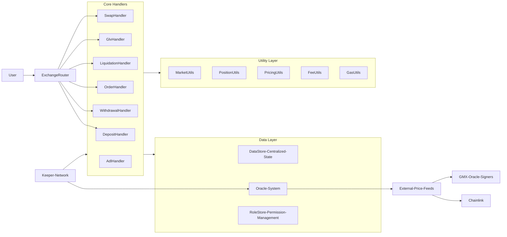

## 核心生命周期流程

### 1. 流动性存款流程

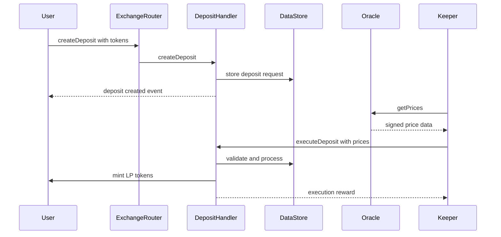

### 2. 永续交易流程

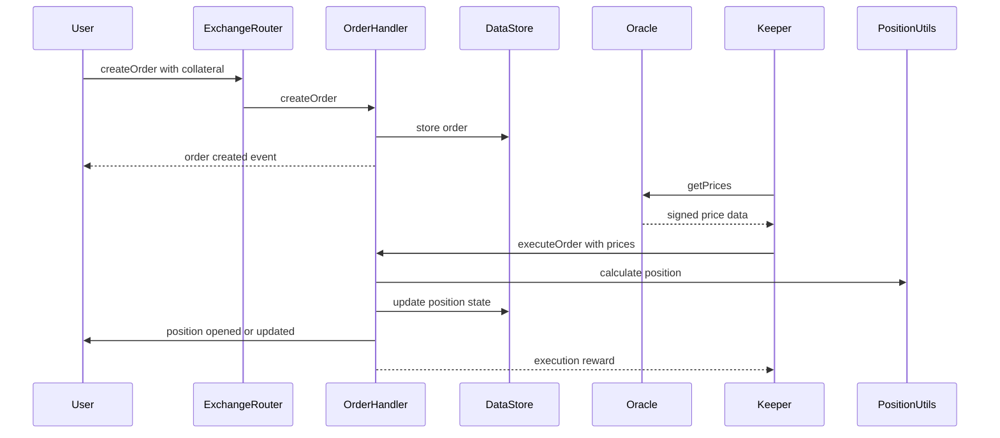

### 3. 清算流程

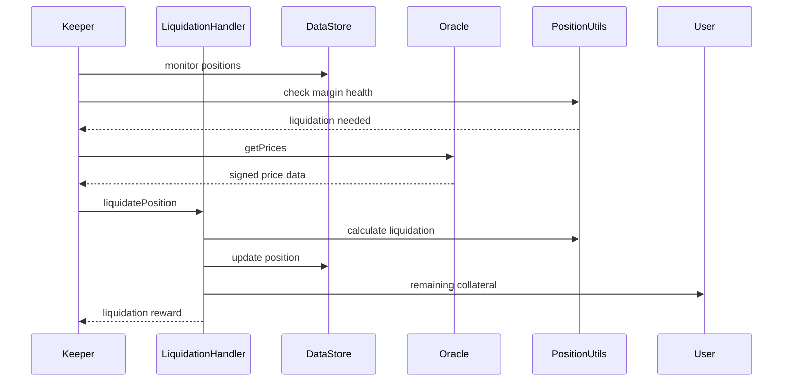

## 预言机系统架构

### 多层预言机设计

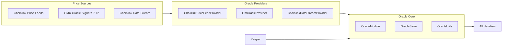

### 预言机验证流程

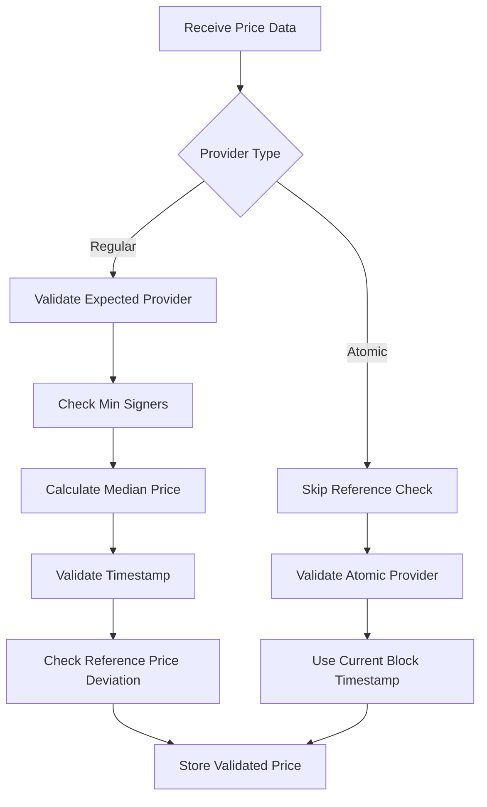

## 费用和激励机制

### 费用分配架构

```mermaid
graph TB
    subgraph Fee Sources
        PositionFee[Position Fees]
        SwapFee[Swap Fees]
        BorrowingFee[Borrowing Fees]
        FundingFee[Funding Fees]
        LiquidationFee[Liquidation Fees]
    end
    
    subgraph Fee Collection
        FeeHandler
        FeeUtils
        FeeBatch[Fee Batch System]
    end
    
    subgraph Distribution
        LPDistribution[LP Distribution 85%]
        ProtocolRevenue[Protocol Revenue 15%]
        InsuranceFund[Insurance Fund]
        ReferralRewards[Referral Rewards]
    end
    
    Fee Sources --> Fee Collection
    Fee Collection --> Distribution
    
    Distribution --> LPPool[LP Pool Value]
    Distribution --> Treasury[Protocol Treasury]
    Distribution --> Insurance[Insurance Pool]
```

### 借贷费用机制

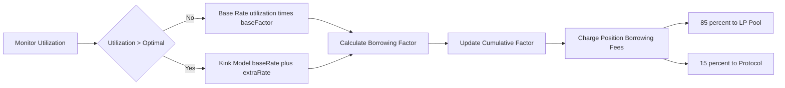

## 关键合约模块

### 处理器合约
- **DepositHandler**: 管理流动性存款和LP代币铸造
- **WithdrawalHandler**: 处理流动性提取和LP代币销毁
- **OrderHandler**: 处理交易订单和仓位管理
- **LiquidationHandler**: 执行基于保证金的清算
- **SwapHandler**: 促进代币交换和转换
- **GlvHandler**: 管理GLV (GMX流动性金库) 操作

### 实用工具合约
- **MarketUtils**: 市场状态计算和验证
- **PositionUtils**: 仓位管理和损益计算
- **PricingUtils**: 价格影响和费用计算
- **FeeUtils**: 费用收取和分配逻辑
- **GasUtils**: Gas优化和估算

### 数据管理
- **DataStore**: 所有协议状态的中央化键值存储
- **RoleStore**: 权限和访问控制管理
- **OracleStore**: 预言机价格数据存储和验证

## 安全架构

### 全局安全措施

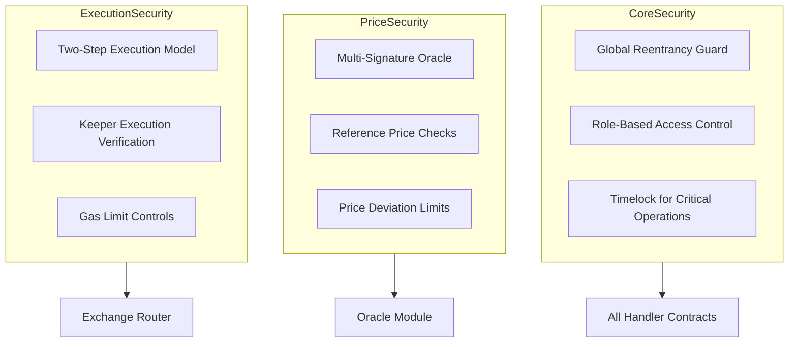

## GLV (GMX流动性金库) 架构

### GLV投资流程

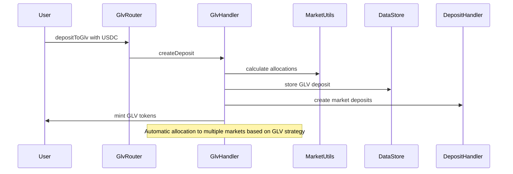

### GLV再平衡机制

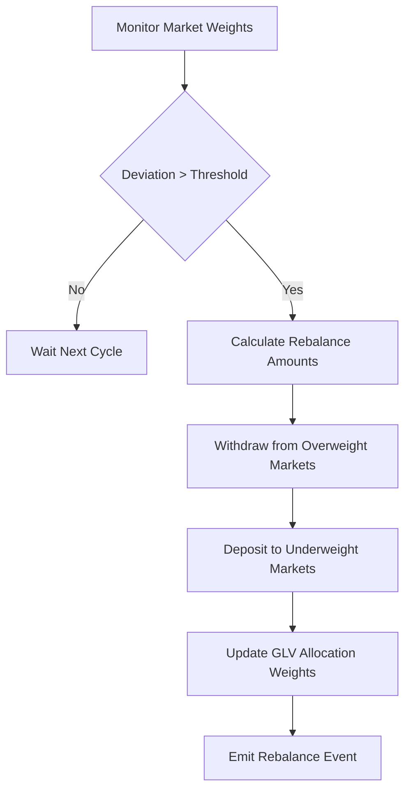

## 子账户系统架构

### 权限管理

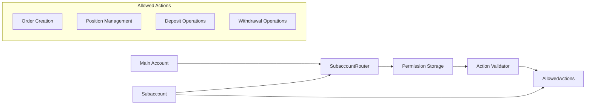

## 性能优化

### Gas效率策略
- **批量操作**: 在单个交易中执行多个操作
- **状态压缩**: 优化的存储布局和位打包
- **选择性更新**: 仅更新已更改的状态变量
- **预计算**: 尽可能在链下计算数值
- **Arbitrum优化**: L1调用数据减少和预编译使用

### 可扩展性特性
- **模块化设计**: 独立的处理器合约
- **异步执行**: 基于Keeper的订单处理
- **水平扩展**: 多个市场和GLV
- **可升级性**: 配置驱动而非代码更改

这个技术架构为GMX Synthetics提供了强大的基础，通过其两步执行模型和多层预言机系统，实现了安全的永续交易、高效的流动性提供和可扩展的协议操作，同时保持了去中心化和公平性。