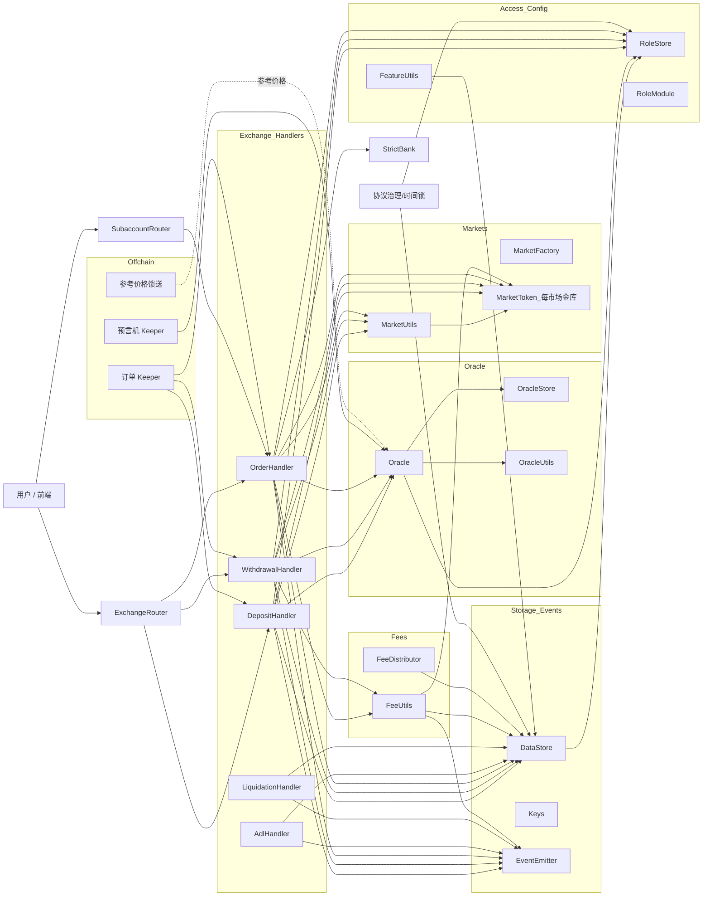
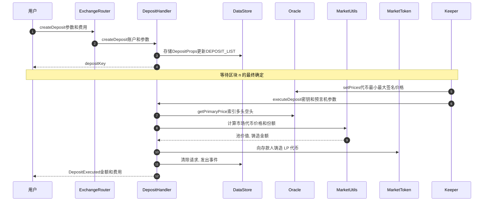
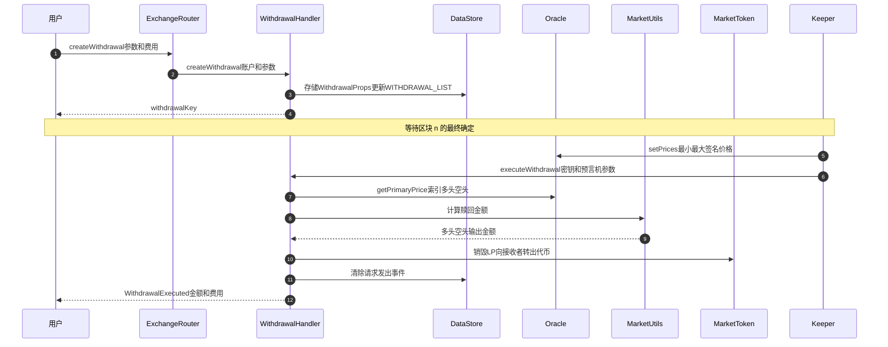
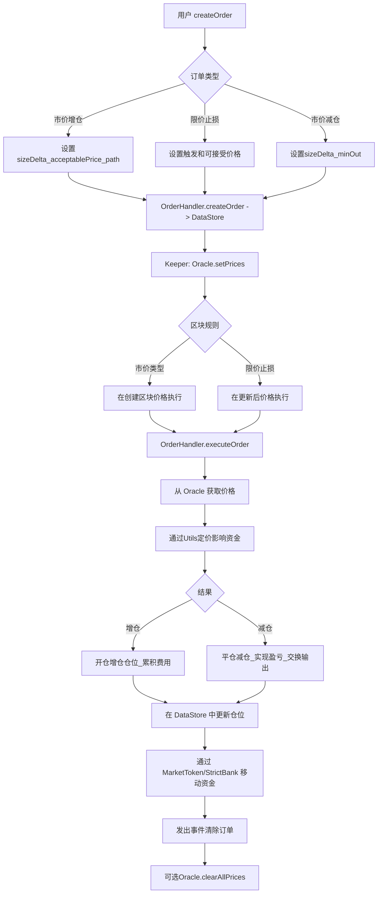
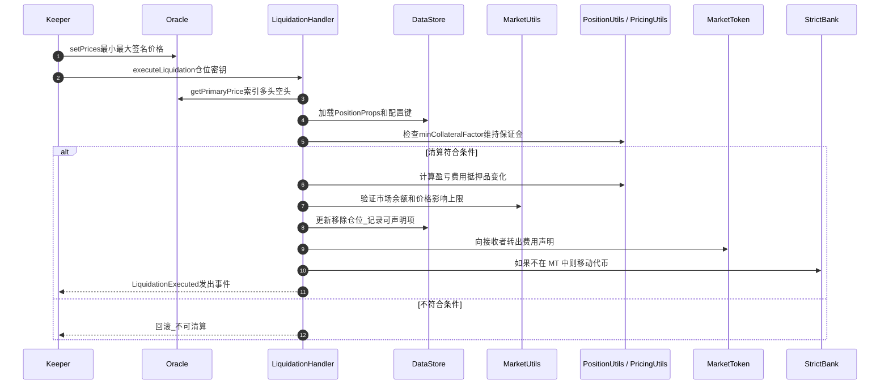
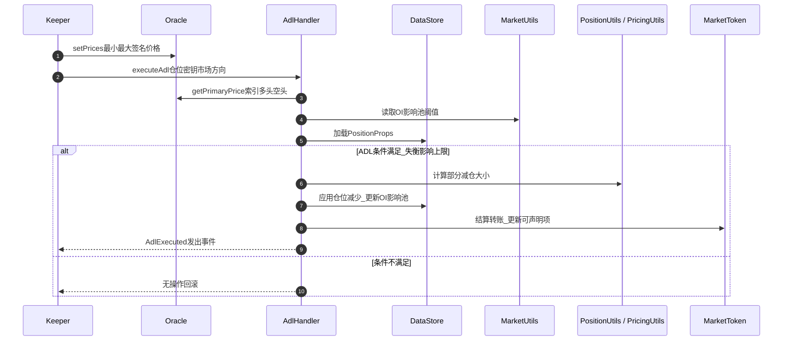

GMX Synthetics — 合约技术架构

范围
- 重点：GMX Synthetics 协议使用的 `contracts/` 中的链上智能合约（存款、提款、交换、永续合约、预言机、费用、市场、存储、角色、路由器、处理器）。
- 超出范围：链下 keeper 二进制文件和 UI；测试工具除非它们澄清合约行为。

架构图

生命周期图

风险流程

高级设计
- 无状态逻辑，有状态存储：大部分业务逻辑位于库和处理器合约中；持久状态集中在 `DataStore` 和少数持有代币的合约（如 `MarketToken`、`StrictBank`）中。这种分离实现了渐进式可升级性并最小化有状态表面积。
- 带预言机的两步执行：用户提交请求；keeper 随后使用同期预言机价格执行。防止 MEV/抢跑并嵌入区块感知价格验证。
- 模块化域：市场、交易（处理器）、预言机、费用、定价、仓位、交换、存款/提款、治理/时间锁、角色/访问和工具。模块通过共享存储键（`Keys`）和事件进行通信。
- 以事件为中心的遥测：通过 `EventEmitter` 和 `*EventUtils` 的丰富、模式灵活的事件支持链下索引，无需紧密的 ABI 耦合。

关键链上组件
- 路由器层
  - `Router`、`BaseRouter`、`ExchangeRouter`、`SubaccountRouter`：用户操作的入口点。管理代币转移（通过插件和 `TokenUtils`）、强制重入保护并调用域处理器。
  - 职责：接受用户参数，路由到处理器，公开声明功能（资金、抵押品、UI 费用），模拟执行助手。

- 交易处理器（状态转换执行器）
  - `DepositHandler`、`WithdrawalHandler`、`OrderHandler`，加上用于风险流程的 `AdlHandler`、`LiquidationHandler`。
  - 生命周期：createX（记录请求），executeX（keeper 根据订单类型在请求区块或之后使用预言机价格结算），cancelX，updateOrder。
  - 使用 `DataStore` 通过 `*StoreUtils` 库存储请求结构并通过 `*EventUtils` 发出事件。

- 存储和键
  - `DataStore`：基本类型、数组和可枚举集合的通用、角色门控 KV 存储。协议状态的主要真相来源（配置值、每市场会计、实体键列表、可声明项等）。
  - `Keys`：所有存储值的 `bytes32` 键的规范命名空间（如市场列表、费用类型、UI 费用因子、每市场上限、预言机设置）。防止键冲突并记录数据模型。
  - `*StoreUtils`：复杂结构的序列化助手（如 `MarketStoreUtils`、`OrderStoreUtils`、`PositionStoreUtils`、`DepositStoreUtils`、`WithdrawalStoreUtils`）。

- 市场
  - 定义：`Market.Props { marketToken, indexToken, longToken, shortToken }` 实例由 `MarketFactory` 创建。流动性和会计隔离每市场风险（现货 + 永续在一个市场中）。
  - `MarketToken`：类似 ERC20 的代币，代表 LP 份额；还托管基础资产并支持 `transferOut` 到接收者进行声明/结算。
  - 核心数学：`MarketUtils` 计算市场代币价格、池价值（`MarketPoolValueInfo`）、验证市场约束、资金、可声明会计和代币余额完整性。

- 预言机
  - `Oracle`：验证、缓存并公开每个代币的主要价格。支持跨多个签名者的中位数最小/最大定价、可选实时馈送和参考价格检查。
  - `OracleStore`：保持签名者集合和配置；`OracleUtils` 提供验证工具和价格（解）压缩。
  - 流程：Keeper 使用打包索引的签名报告调用 `setPrices`；验证的价格在执行窗口期间临时存在于 `Oracle` 中，并通过 `clearAllPrices` 清除。

- 订单和仓位
  - `Order`：编码用户对交换和永续合约（增仓/减仓）的意图，包括可接受/触发价格、路径、回调配置和执行费用。存储在 `DataStore` 下的 `OrderStoreUtils` 中并由 `OrderHandler` 处理。
  - `Position`：跟踪每仓位会计；`PositionUtils` 和相关库计算大小、盈亏、抵押品变化、价格影响调整和清算检查。
  - 价格影响和资金：`PricingUtils`、`PositionPricingUtils` 和 `MarketUtils` 处理池感知价格影响、虚拟库存和每市场可配置资金曲线。

- 存款和提款
  - 存款：`ExchangeRouter.createDeposit` → `DepositHandler.createDeposit` 记录请求；执行基于池价值和创建区块的预言机价格铸造 `MarketToken`。
  - 提款：与存款对称；销毁 `MarketToken` 用于多头/空头代币赎回，使用创建区块预言机数据定价。两者都包括 keeper 的执行费用资助。

- 交换和永续合约执行
  - 交换：通过市场多头/空头池序列路由；输出受 minOut 和价格影响约束。市价和限价变体在哪个区块的预言机价格有效方面有所不同。
  - 永续合约增仓/减仓：增仓通过路径转换初始抵押品，设置大小、可接受价格界限以及资金/费用；减仓关闭大小，实现盈亏，应用影响，并可选地沿路径交换提款。止损/限价语义取决于预言机区块范围。

- 费用和声明
  - `FeeUtils`、`FeeHandler`、`FeeDistributor`、`FeeSwapUtils`：跟踪并实现每市场/代币的交换/仓位/UI 费用。可声明项存储在 `DataStore` 中并从 `MarketToken` 余额中支付；路由器公开 `claimFundingFees`、`claimCollateral`、`claimAffiliateRewards`、`claimUiFees`。
  - UI 费用：每账户可配置的 UI 费用因子，具有每市场累积和声明路径。

- 访问控制和安全
  - 角色：`RoleStore` + `RoleModule` 门控特权功能（如 `DataStore.set*`、`Oracle.setPrices`、处理器执行）。通过 `FeatureUtils` 的功能标志和 `Keys` 中的每功能禁用键允许精细控制。
  - 重入：路由器/处理器中的 `GlobalReentrancyGuard` 和 `ReentrancyGuard`；在 `PayableMulticall` 中对 `msg.value` 语义的谨慎 `delegatecall` 注意。
  - 银行：`StrictBank` 集中托管和转移规则，用于未持有在 `MarketToken` 金库中的代币。
  - 错误：`Errors.sol` 和 `ErrorUtils.sol` 集中回滚原因以保持一致性和 gas 效率。

执行模型和流程
- 请求创建
  - 用户使用调用数据和执行费用调用路由器（`ExchangeRouter`）；代币根据需要通过 `Router` 插件/WNT 移动。处理器在 `DataStore` 中持久化请求结构并发出事件。

- 价格设置
  - Keeper 使用签名者压缩数据通过 `Oracle.setPrices` 设置预言机价格；`Oracle` 存储每代币的 `Price.Props { min, max }`，检查参考馈送，并跟踪区块/时间范围。

- 请求执行
  - Keeper 使用当前 `Oracle` 状态调用处理器执行功能。处理器加载请求、获取价格、计算输出/费用/影响、更新存储、从 `MarketToken` 或 `StrictBank` 移动资金并发出事件。`Oracle.clearAllPrices` 在批次后清理。

数据模型亮点（在 `DataStore` 中）
- 全局配置：WNT、费用接收者、严格价格馈送模式、gas 限制、功能切换、每市场上限和风险参数。
- 实体注册表：`MARKET_LIST`、`ORDER_LIST`、`POSITION_LIST`、`DEPOSIT_LIST`、`WITHDRAWAL_LIST`，加上每账户变体，用于高效迭代而无需链下索引器。
- 会计：费用、抵押品、附属/UI 奖励的可声明项；每市场资金状态；虚拟库存和影响池；借贷/资金参数。

安全性和不变量
- 市场偿付能力：`MarketUtils.validateMarketTokenBalance` 确保 `MarketToken` 支持在声明/转移后与会计匹配。
- 预言机合理性：参考价格偏差内的中位数签名者价格；最小/最大排序验证；零/负价格保护；每代币乘数对齐。
- 路径唯一性：通过 `Keys` 值的交换路径唯一性检查和最大路径长度上限；所有状态变更的重入和访问控制。

升级和可扩展性
- 新市场：`MarketFactory` 注册 `Market.Props` 并部署 `MarketToken`；行为由 `DataStore` 中的全局和每市场键控制。
- 新功能：通过 `FeatureUtils` 和配置键门控添加库/处理器；`DataStore` 键空间允许在不改变存储布局的情况下向结构追加字段。
- 事件：`*EventUtils` 支持在不更改 ABI 的情况下添加字段，以保持链下消费者的弹性。

操作角色和 Keeper
- 预言机 keeper：获取交易所价格，使用区块范围签署压缩价格，提交到 `Oracle`。
- 订单 keeper：扫描 `DataStore` 列表，捆绑当前预言机价格，并执行排队的请求。
- 治理：`ProtocolGovernor`、`GovTimelockController`、`GovToken` 通过提案和时间锁管理参数化和特权角色。

值得注意的合约路径
- 路由器：`contracts/router/*`（入口点、代币路由、用户声明）。
- 交易：`contracts/exchange/*`（存款/提款/订单处理器、ADL、清算）。
- 市场：`contracts/market/*`（市场定义、工具、代币、定价、事件、存储）。
- 预言机：`contracts/oracle/*`（验证、存储、乘数数学、实时馈送）。
- 数据：`contracts/data/*`（`DataStore`、`Keys`、序列化工具）。
- 费用：`contracts/fee/*`（费用累积和分配、UI 费用）。
- 工具：`contracts/utils/*`（数学、数组、精度、重入保护、多调用）。
- 角色：`contracts/role/*`（RBAC）、`contracts/config/*`（时间锁和全局配置）。

端到端示例（市价增仓订单）
1) 用户使用增仓参数、可接受价格、路径、执行费用调用 `ExchangeRouter.createOrder`；代币通过 `Router` 移入。
2) `OrderHandler.createOrder` 在 `DataStore` 中持久化 `Order.Props` 并发出创建事件；`ORDER_LIST` 和账户列表更新。
3) Keeper 使用 `Oracle.setPrices`（最小/最大、区块界限）为所需代币设置预言机价格。
4) Keeper 调用 `OrderHandler.executeOrder`；处理器加载订单，从 `Oracle` 获取价格，计算大小、费用、价格影响、资金；在 `DataStore` 中更新仓位。
5) 资金通过 `MarketToken` 和/或 `StrictBank` 结算；通过 `FeeUtils` 更新可声明项；发出事件。
6) Keeper 在批次后清除价格（`Oracle.clearAllPrices`）。

附录：设计理由
- 通过 `DataStore` 和 `Keys` 最小化存储耦合保持升级灵活性并减少迁移风险。
- 请求/执行分离将链上结算与链下价格发现对齐，同时防止同一区块价格操纵。
- 使用通用事件和可枚举集合允许强大的链上状态内省和链下索引，而不会有脆弱的 ABI 更改。